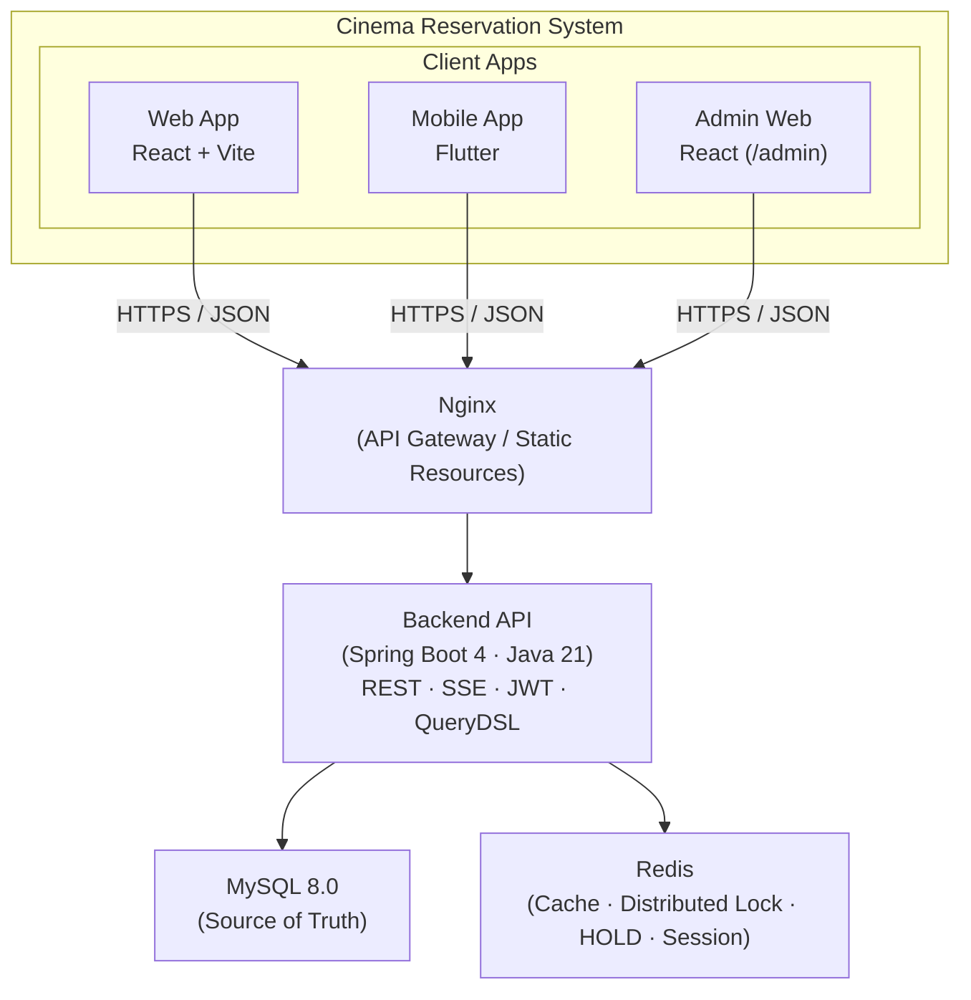

# 영화관 예매 시스템 (Cinema Reservation System)

멀티플렉스 영화관의 **실시간 좌석 예매**를 지원하는 풀스택 예제 프로젝트입니다.
회원 필수, 좌석 지정 방식(수동 선택), 실시간·사전 예매를 지원하며, 웹(React) / 모바일(Flutter) / 백엔드(Spring Boot)로 구성됩니다.

---

## 프로젝트 설명

본 프로젝트는 **Domain-Driven Design(DDD)** 기반의 영화관 예매 도메인을 다룹니다.

- **사용자**: 영화·상영 시간표 조회, 좌석 선택(HOLD), 결제, 예매 내역 조회
- **관리자**: 영화/상영관/상영 스케줄 관리, 좌석 배치 설정, 예매·결제·취소 조회
- **동시성**: Redis 분산 락 + HOLD TTL로 중복 예매 방지, 좌석 클릭 TPS 1000 목표
- **실시간**: WebSocket/SSE로 좌석 상태 변경을 클라이언트에 푸시

개발 환경은 H2 인메모리 DB, 운영 환경은 MySQL + Redis를 사용합니다.

---

## 프로젝트 특징

| 구분 | 내용 |
| ------ | ------ |
| **아키텍처** | DDD, Aggregate Root(Screening), Stateless REST API |
| **동시성** | Redisson 분산 락, Redis HOLD + TTL, 트랜잭션 일관성 |
| **실시간** | SSE 기반 좌석 상태 브로드캐스트, 새로고침 없이 좌석 갱신 |
| **보안** | JWT + Refresh Token, HOLD Token 검증, API Rate Limit, RSA 하이브리드 암호화 |
| **장애 대응** | Redis 장애 시 DB Fallback 조회, Redis 복구 후 상태 동기화 |
| **UI/UX** | 다크 테마, 글래스모피즘, 수평 스크롤 영화 목록, 좌석 선택 bouncy 애니메이션 |

---

## 아키텍처 구조



- **백엔드**: Controller → Service → Domain → Infrastructure 레이어, Screening Aggregate Root가 좌석 상태 관리
- **좌석 상태**: AVAILABLE → HOLD → PAYMENT_PENDING → RESERVED / CANCELLED 등 7가지 상태 전이
- 상세 다이어그램(ERD, 시퀀스, 상태 머신)은 [doc/ARCHITECTURE_ALL.md](doc/ARCHITECTURE_ALL.md), [doc/ARCHITECTURE_BACKEND.md](doc/ARCHITECTURE_BACKEND.md) 참고

---

## 스킬 구성 (기술 스택)

| 영역 | 기술 | 비고 |
| ------ | ------ | ------ |
| **Backend** | Spring Boot 4.0.2, Java 21 | Web, JPA, Redis, Security, WebSocket, Actuator |
| | QueryDSL 5.1 (Jakarta), Gson, Lombok | |
| | JWT (jjwt 0.12), Redisson 3.40 (분산 락) | |
| | SpringDoc OpenAPI 3.0.1 (Swagger UI) | |
| **Frontend (Web)** | React 19, TypeScript, Vite 7 | Tailwind CSS 4, Zustand, React Router 7, Axios |
| **Frontend (Mobile)** | Flutter, Dart 3.10+ | Riverpod, Google Fonts |
| **Database** | H2 (dev), MySQL 8.0 (prod) | JPA/Hibernate |
| **Cache / Lock** | Redis | Redisson, Lettuce |
| **Infrastructure** | Docker, Docker Compose, Nginx | [infra/](infra/) |

---

## 프로젝트 설정

### 요구 사항

- **JDK 21** (백엔드)
- **Node.js 18+**, **npm** (웹 프론트엔드)
- **Flutter SDK** (모바일, 선택)
- **MySQL 8.0**, **Redis** (운영·통합 테스트 시; 개발은 H2만으로 가능)

상세 환경 설정은 [doc/DEVELOPMENT_ENVIRONMENT.md](doc/DEVELOPMENT_ENVIRONMENT.md)를 참고하세요.

### 디렉터리 구조

```text
spring-cinema-app-ex/
├── src/                    # 백엔드 (Spring Boot)
│   ├── main/java/com/cinema/
│   │   ├── domain/         # 도메인 (회원, 영화, 상영, 예매, 결제, 좌석)
│   │   ├── global/         # 설정, 보안, 예외, JWT, Redis
│   │   └── infrastructure/ # Redis, 락, SSE, 스케줄러
│   └── test/
├── frontend/               # React 웹 (사용자 + 관리자)
├── mobile/                 # Flutter 앱 (사용자)
├── infra/                  # Docker, Nginx, MySQL/Redis 초기 스크립트
├── loadtest/               # JMeter 부하 테스트
└── doc/                    # 설계·운영·가이드 문서
```

---

## 프로젝트 실행 방법

### 1. 백엔드 (Spring Boot)

기본 프로파일은 `dev`(H2 인메모리)입니다. Redis 없이도 기동 가능하며, Redis 미연결 시 분산 락/HOLD는 비활성화됩니다.

```bash
# 프로젝트 루트에서
./gradlew bootRun

# 프로파일 지정
./gradlew bootRun --args='--spring.profiles.active=dev'   # H2 (기본)
./gradlew bootRun --args='--spring.profiles.active=prod'  # MySQL
```

- **API**: <http://localhost:8080>
- **Swagger UI**: <http://localhost:8080/swagger-ui.html>
- **H2 Console (dev)**: <http://localhost:8082/h2-console>

### 2. 웹 프론트엔드 (React)

```bash
cd frontend
npm install
npm run dev
```

- **접속**: <http://localhost:5173> (Vite 기본)

### 3. 모바일 (Flutter, 선택)

```bash
cd mobile
flutter pub get
flutter run
```

### 4. Docker Compose (전체 인프라 + 앱)

MySQL, Redis, 백엔드, 프론트엔드, 모바일 웹을 한 번에 띄우려면 [infra/README.md](infra/README.md) 및 [doc/DOCKER_SETUP.md](doc/DOCKER_SETUP.md)를 참고하세요.

---

## 프로젝트 문서 링크

| 문서 | 설명 |
| ------ | ------ |
| [doc/README.md](doc/README.md) | **문서 목차** (전체 문서 인덱스) |
| [doc/PRD.md](doc/PRD.md) | 제품 요구사항 (목표, 성능, 보안, 기술 스택) |
| [doc/RULE.md](doc/RULE.md) | 개발 규칙 (아키텍처, 좌석 상태, Redis, 트랜잭션, 보안) |
| [doc/TASK.md](doc/TASK.md) | 작업 계획 (Step별 목표, 체크리스트, 일정) |
| [doc/ARCHITECTURE_ALL.md](doc/ARCHITECTURE_ALL.md) | 전체 시스템 아키텍처 (C4, 데이터 흐름) |
| [doc/ARCHITECTURE_BACKEND.md](doc/ARCHITECTURE_BACKEND.md) | 백엔드 아키텍처 (ERD, 상태 머신, 시퀀스) |
| [doc/ARCHITECTURE_FRONTEND.md](doc/ARCHITECTURE_FRONTEND.md) | 프론트엔드 아키텍처 (React, 라우팅, API) |
| [doc/ARCHITECTURE_MOBILE.md](doc/ARCHITECTURE_MOBILE.md) | 모바일 아키텍처 (Flutter, Riverpod) |
| [doc/SERVER_STARTUP_GUIDE.md](doc/SERVER_STARTUP_GUIDE.md) | 서버 구동 가이드 (프로파일, DB/Redis 설정) |
| [doc/DEVELOPMENT_ENVIRONMENT.md](doc/DEVELOPMENT_ENVIRONMENT.md) | 개발 환경 세팅 (Java, Node, Flutter, MySQL, Redis) |
| [doc/DEPLOYMENT.md](doc/DEPLOYMENT.md) | 배포 가이드 |
| [doc/OPERATIONS.md](doc/OPERATIONS.md) | 운영 가이드 (모니터링, 장애 대응) |
| [doc/TROUBLESHOOTING.md](doc/TROUBLESHOOTING.md) | 문제 해결 가이드 |

---

## 참고 문서 링크

- [Spring Boot](https://spring.io/projects/spring-boot)
- [React](https://react.dev/)
- [Flutter](https://flutter.dev/)
- [Redis](https://redis.io/)
- [Domain-Driven Design (DDD)](https://martinfowler.com/bliki/DomainDrivenDesign.html)

---

## 라이선스

MIT License.
자세한 내용은 [LICENSE](LICENSE) 파일을 참고하세요.
