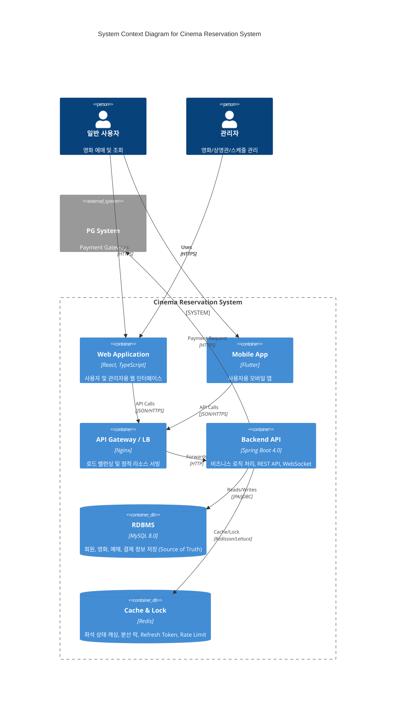

# 전체 시스템 아키텍처 (System Architecture)

## 1. 시스템 컨테이너 다이어그램

영화 예매 시스템의 전체적인 컨테이너 구조와 상호작용을 나타냅니다.

## 2. 기술 스택 요약

| 영역 | 기술 스택 | 설명 |
|------|-----------|------|
| **Frontend (Web)** | React, TypeScript, Vite, Zustand | 사용자 및 관리자 웹 |
| **Frontend (Mobile)** | Flutter, Riverpod | 안드로이드/iOS 앱 |
| **Backend** | Spring Boot 4.0.2, Java 21 | 핵심 비즈니스 로직 |
| **Database** | MySQL 8.0 | 영구 데이터 저장소 |
| **Cache/Lock** | Redis | 분산 락, 세션, 캐싱 |
| **Infrastructure** | Docker, Docker Compose | 컨테이너 기반 배포 |

## 3. 핵심 데이터 흐름

1. **조회**: 클라이언트는 API를 통해 영화/상영 정보를 조회합니다. (Redis 캐싱 적용 가능)
2. **좌석 선점**:
   - Redis 분산 락을 통해 동시성을 제어합니다.
   - 선점 성공 시 Redis에 HOLD 상태와 TTL을 설정하고 HOLD Token을 발급합니다.
3. **결제 및 예매 확정**:
   - HOLD Token을 검증합니다.
   - 결제 성공 시 DB에 예매 정보를 저장하고(Source of Truth), Redis 상태를 정리합니다.
4. **실시간 갱신**: 좌석 상태 변경 시 WebSocket/SSE를 통해 접속 중인 클라이언트에게 변경된 좌석 ID만 푸시합니다.
