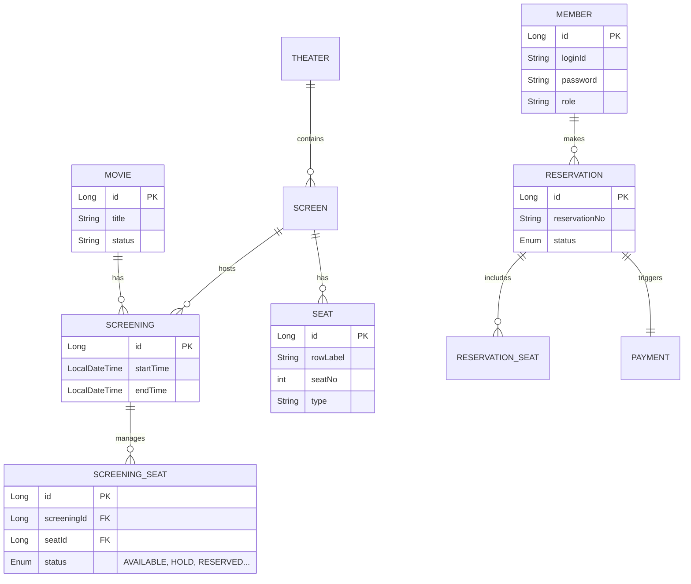
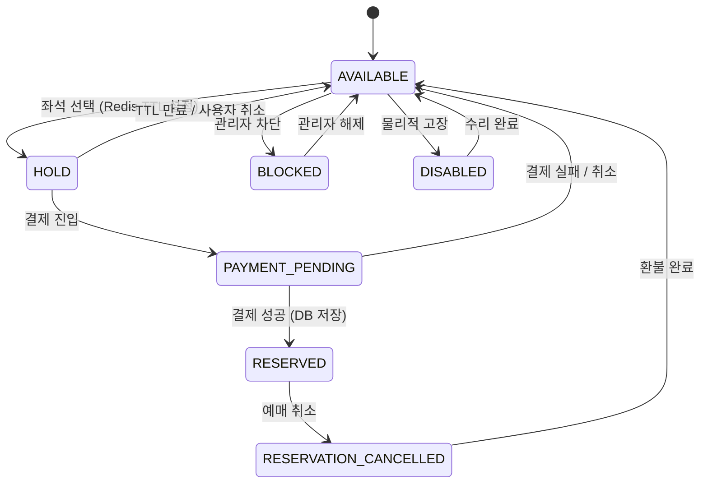
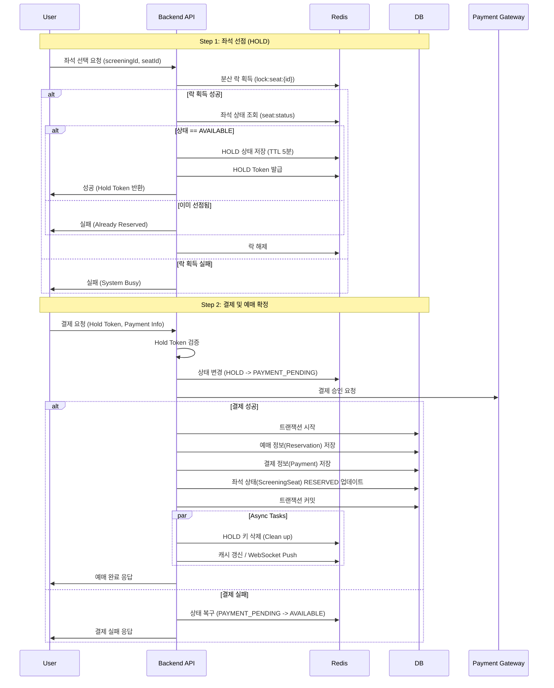

# 백엔드 아키텍처 (Backend Architecture)

> **관련 문서**: [ARCHITECTURE_ALL.md](./ARCHITECTURE_ALL.md) | [BACKEND_MODULES.md](./BACKEND_MODULES.md)

## 1. 도메인 모델 (ERD)

주요 엔티티 간의 관계를 나타냅니다. `Screening`이 Aggregate Root 역할을 수행하며 좌석을 관리합니다.

## 2. 좌석 상태 머신 (Seat State Machine)

`RULE.md`에 정의된 7가지 좌석 상태의 전이 과정입니다.

## 3. 핵심 로직: 좌석 예매 시퀀스 (Reservation Sequence)

동시성 제어와 데이터 일관성을 보장하기 위한 흐름입니다.

## 4. 패키지 구조 (DDD)

| 패키지 | 설명 |
|--------|------|
| `domain.member` | 회원, 인증(JWT), Refresh Token |
| `domain.movie` | 영화 정보 |
| `domain.theater` | 극장, 상영관, 좌석 |
| `domain.screening` | **[Aggregate Root]** 상영 스케줄, 좌석 상태 관리, HOLD/해제 |
| `infrastructure.scheduler` | HoldExpiryScheduler (HOLD 만료 자동 해제) |
| `domain.reservation` | 예매 생성, 취소 |
| `domain.payment` | 결제 처리, 검증 (Mock) |
| `domain.admin` | 관리자 API (영화/극장/상영관/상영/좌석/예매/결제) |
| `application.log` | 클라이언트 로그 수신 (POST /api/logs) |
| `infrastructure.redis` | RedisService, RedisHealthIndicator, RedisHealthChecker, RedisStateSyncService |
| `infrastructure.lock` | DistributedLockManager (Redisson) |
| `infrastructure.sse` | SeatSseBroadcaster |
| `global` | 예외 처리, Security, CORS, JWT, Rate Limit |

## 5. Redis 장애 대응 (Step 18)

- **Health Check**: `RedisHealthIndicator` — `/actuator/health`에 Redis 상태 포함
- **장애 감지**: `RedisHealthChecker` — 30초 주기 ping, `redisAvailable` 갱신
- **쓰기 Fail Fast**: `cinema.redis.fail-fast-on-write=true` — Redis 장애 시 예매(HOLD/결제) 차단
- **복구 동기화**: `RedisStateSyncService` — Redis 복구 시 DB HOLD → Redis 동기화
