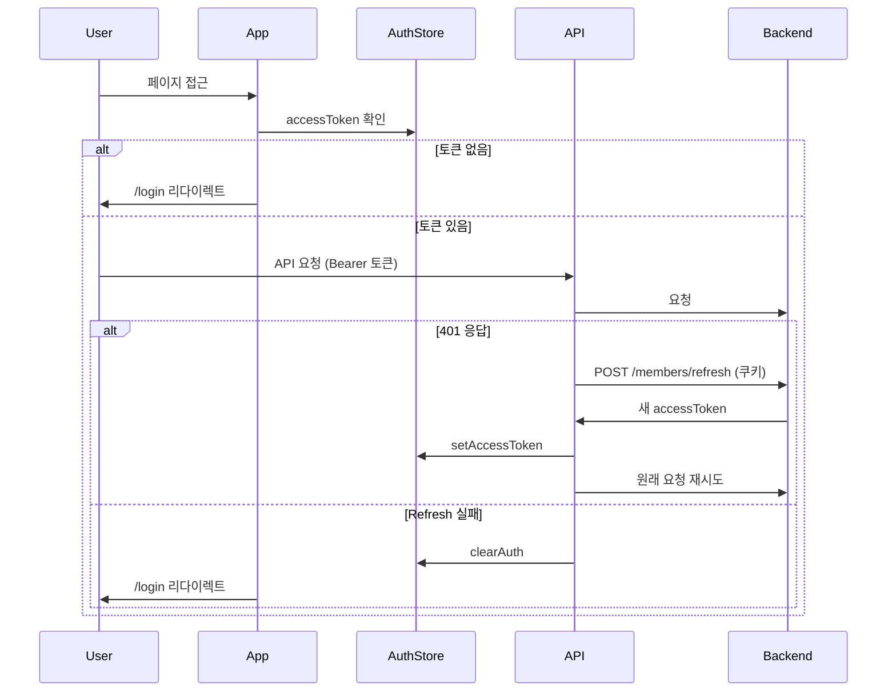

# 프론트엔드 아키텍처 (Frontend Architecture)

> **관련 문서**: [ARCHITECTURE_ALL.md](./ARCHITECTURE_ALL.md) | [FRONTEND_MODULES.md](./FRONTEND_MODULES.md)

## 1. 기술 스택

| 항목 | 기술 |
|------|------|
| **프레임워크** | React 19, TypeScript |
| **빌드** | Vite 7 |
| **라우팅** | React Router 7 |
| **상태 관리** | Zustand (authStore) |
| **HTTP** | Axios (인터셉터: JWT, Refresh Token) |
| **스타일** | Tailwind CSS 4, Cinema 테마 변수 |
| **데이터 페칭** | TanStack React Query (선택적) |

## 2. 라우팅 구조

```mermaid
graph TD
    subgraph Main [사용자 영역 /]
        Home[/]
        Movies[/movies]
        Book[/book/:screeningId]
        Payment[/payment/:screeningId]
        Reservations[/reservations]
        ReservationDetail[/reservations/:reservationId]
        MyPage[/mypage]
        Login[/login]
        Signup[/signup]
    end

    subgraph Admin [관리자 영역 /admin]
        AdminDashboard[/admin]
        AdminLogin[/admin/login]
        AdminMovies[/admin/movies]
        AdminTheaters[/admin/theaters]
        AdminScreens[/admin/screens]
        AdminScreenings[/admin/screenings]
        AdminSeats[/admin/seats]
        AdminReservations[/admin/reservations]
        AdminPayments[/admin/payments]
    end

    Main --> MainLayout
    Admin --> AdminLayout
```

- **MainLayout**: 네비게이션 바 + Outlet
- **AdminLayout**: 사이드바 + 헤더 + Outlet, `/admin/login` 제외 인증 필요

## 3. 디렉터리 구조

```
frontend/src/
├── api/              # API 클라이언트 (axiosInstance, auth, movies, seats, reservations 등)
├── components/
│   ├── auth/         # 인증 관련
│   ├── booking/      # SeatMap, HoldTimer
│   ├── common/       # Modal, NeonButton, GlassCard, NavigationBar, NavigationLogger
│   └── common/ui/    # ConfirmDialog, EmptyState, LoadingSpinner, Pagination, Toast
├── hooks/            # useToast, useIsAdmin, useSeatEvents
├── layouts/          # MainLayout, AdminLayout
├── pages/            # 페이지 컴포넌트
│   └── admin/        # 관리자 페이지
├── stores/           # authStore (Zustand)
├── types/            # TypeScript 타입 정의
└── utils/            # dateUtils, errorHandler, formatters, hybridEncryption, jwt, logger
```

## 4. 인증 흐름



- **authStore**: `accessToken`, `isAuthenticated`, `setAccessToken`, `clearAuth`
- **axiosInstance**: 요청 시 `Authorization: Bearer` 주입, 401 시 Refresh 후 재시도

## 5. API 레이어

| 모듈 | 경로 | 용도 |
|------|------|------|
| `axiosInstance` | `api/axiosInstance.ts` | 공통 Axios 인스턴스 (baseURL, JWT, Refresh) |
| `auth` | `api/auth.ts` | 로그인, 회원가입, 로그아웃 |
| `movies` | `api/movies.ts` | 영화 목록, 상영 목록 |
| `seats` | `api/seats.ts` | 좌석 배치, HOLD, HOLD 해제 |
| `reservations` | `api/reservations.ts` | 결제, 예매 목록·상세, 취소 |
| `members` | `api/members.ts` | 프로필 조회/수정, 장바구니(HOLD) |
| `home` | `api/home.ts` | 홈 통계, 상영 예정 영화 |
| `admin` | `api/admin.ts` | 관리자 CRUD (영화, 극장, 상영관, 상영, 좌석, 예매, 결제) |

## 6. 공통 컴포넌트

| 컴포넌트 | 용도 |
|----------|------|
| `Modal` | 모달 래퍼 (ESC, 배경 클릭 닫기) |
| `ConfirmDialog` | 확인/취소 다이얼로그 |
| `Toast` / `ToastContainer` / `useToast` | 토스트 알림 |
| `LoadingSpinner` | 로딩 인디케이터 |
| `EmptyState` | 데이터 없음 표시 |
| `Pagination` | 페이지네이션 |
| `GlassCard` | 글래스모피즘 카드 |
| `NeonButton` | CTA 버튼 |
| `NavigationBar` | 상단 네비게이션 |
| `NavigationLogger` | 화면 이동 로그 |
| `SeatMap` | 좌석 맵 (클릭 HOLD/해제) |
| `HoldTimer` | HOLD 남은 시간 표시 |

## 7. 예매 플로우 (사용자)

1. **영화 선택** → `/movies` → 영화별 상영 목록
2. **상영 선택** → `/book/:screeningId` → 좌석 배치 (SeatMap)
3. **좌석 HOLD** → `seatsApi.holdSeat()` → holdToken 발급
4. **결제하기** → `/payment/:screeningId` (state로 heldSeats 전달)
5. **결제** → `reservationsApi.pay()` → 예매 완료
6. **예매 내역** → `/reservations`, `/reservations/:id`

## 8. 실시간 좌석 갱신 (useSeatEvents)

- **SSE** 또는 **WebSocket**으로 좌석 상태 변경 수신
- `useSeatEvents(screeningId, callback)` — 변경된 seatId 목록 수신 시 callback 호출
- SeatSelectPage에서 변경된 좌석만 재조회하여 UI 갱신

## 9. 테마 (Cinema)

- **index.css**: `--color-cinema-*` CSS 변수 (background, surface, neon-blue, neon-red 등)
- **Tailwind**: `cinema-bg`, `cinema-text`, `cinema-neon-blue` 등 커스텀 클래스
- **다크 테마** 기본 적용

## 10. 로깅

- **loglevel** 패키지
- **logger.ts**: 화면 이동, 좌석 HOLD/해제, 예매 완료, 관리자 등록/수정 로그
- **NavigationLogger**: MainLayout, AdminLayout에 배치 — 라우트 변경 시 로그
- 백엔드 `POST /api/logs` 전송 → `logs/frontend.log` 저장 (7일 보관)
