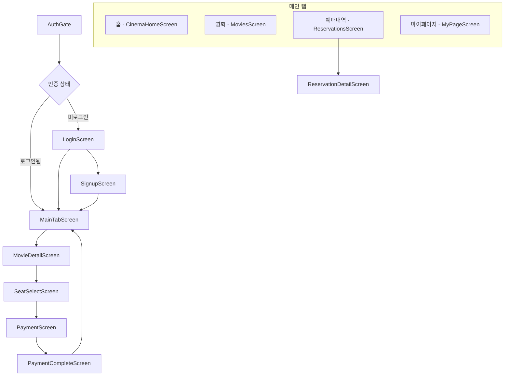
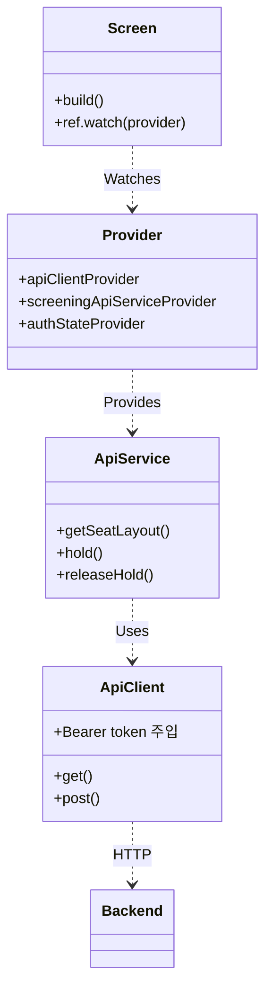

# 모바일 아키텍처 (Mobile Architecture)

> **관련 문서**: [ARCHITECTURE_ALL.md](./ARCHITECTURE_ALL.md) | [MOBILE_MODULES.md](./MOBILE_MODULES.md)

## 1. 앱 네비게이션 구조

Flutter 앱의 화면 흐름도입니다.



## 2. 디렉터리 구조

```
mobile/lib/
├── config/       # API 경로 (api_config.dart)
├── exception/    # AppException, ApiException, ErrorCode
├── models/       # API 응답 DTO (movie, seat, reservation 등)
├── provider/     # Riverpod (auth, api, main_tab)
├── screens/      # 화면 위젯 (auth, home, movies, seat, payment, reservations, mypage)
├── services/     # API 호출 (ApiClient, AuthApiService, ScreeningApiService 등)
├── theme/        # CinemaTheme, CinemaColors
├── utils/        # app_logger, hybrid_encryption, jwt_utils
└── widgets/      # GlassCard, NeonButton, ErrorDialog, LoadingOverlay
```

## 3. 아키텍처 패턴 (Riverpod + 서비스 레이어)



## 4. 주요 기술적 고려사항

| 항목 | 구현 |
|------|------|
| **상태 관리** | `flutter_riverpod` — 전역 상태, 비동기 데이터(AsyncValue) |
| **네트워크** | `http` 패키지, `ApiClient`에 Bearer 토큰 콜백 주입 |
| **인증** | `flutter_secure_storage`로 Access/Refresh 토큰 저장 |
| **암호화** | 하이브리드 암호화(RSA-OAEP + AES-GCM) — 로그인/회원가입 비밀번호 |
| **좌석 맵** | `SeatSelectScreen` — 좌석 그리드 렌더링 |
| **실시간 통신** | `seat_sse_client.dart` — SSE로 좌석 상태 변경 수신 |
| **로깅** | `app_logger`, `file_log_service` — 파일 저장(7일), 백엔드 전송 |
