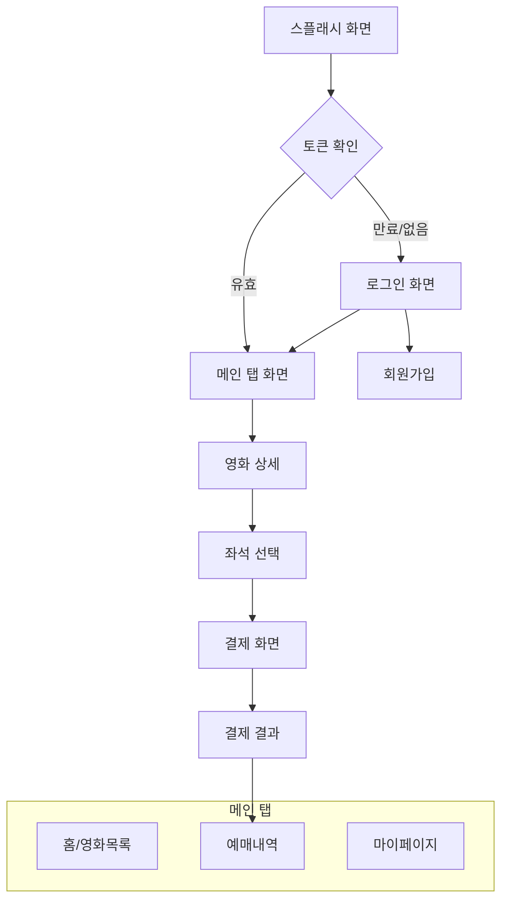
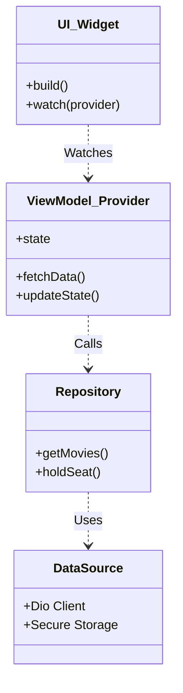

# 모바일 아키텍처 (Mobile Architecture)

## 1. 앱 네비게이션 구조

Flutter 앱의 화면 흐름도입니다.

## 2. 아키텍처 패턴 (Riverpod + MVVM)

상태 관리와 비즈니스 로직 분리를 위한 구조입니다.

## 3. 주요 기술적 고려사항

- **상태 관리**: `flutter_riverpod`를 사용하여 전역 상태 및 비동기 데이터 관리
- **네트워크**: `Dio` 패키지 사용, Interceptor를 통한 JWT 토큰 자동 주입 및 갱신
- **좌석 맵**: `CustomPainter`를 사용하여 고성능 좌석 그리드 렌더링
- **실시간 통신**: `web_socket_channel` 또는 SSE 클라이언트를 통한 좌석 상태 수신
