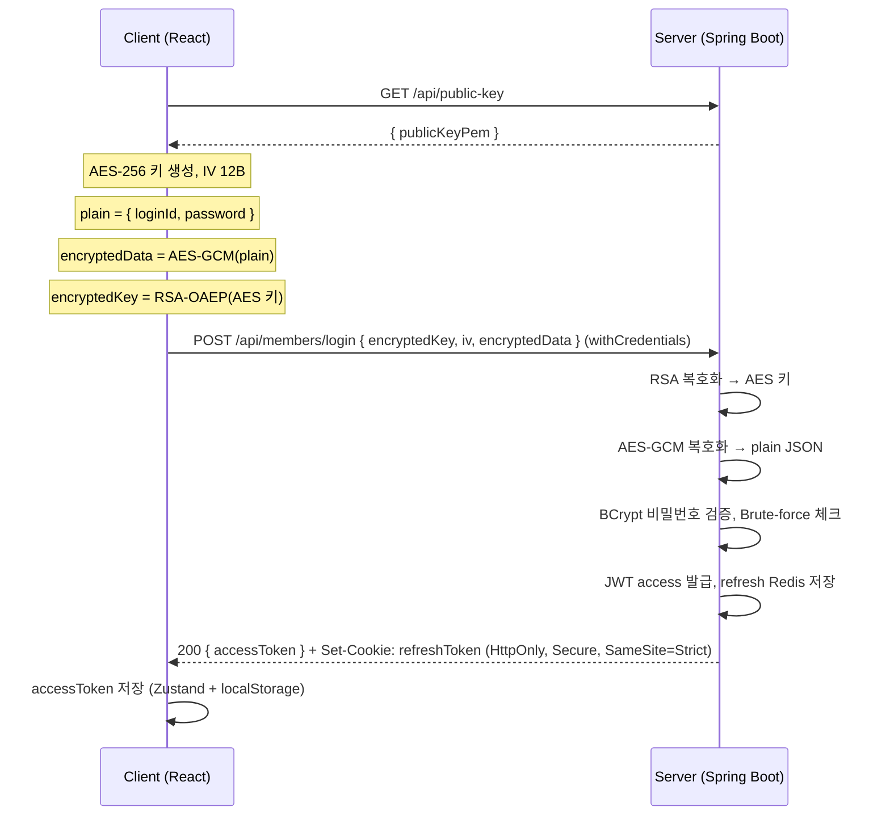
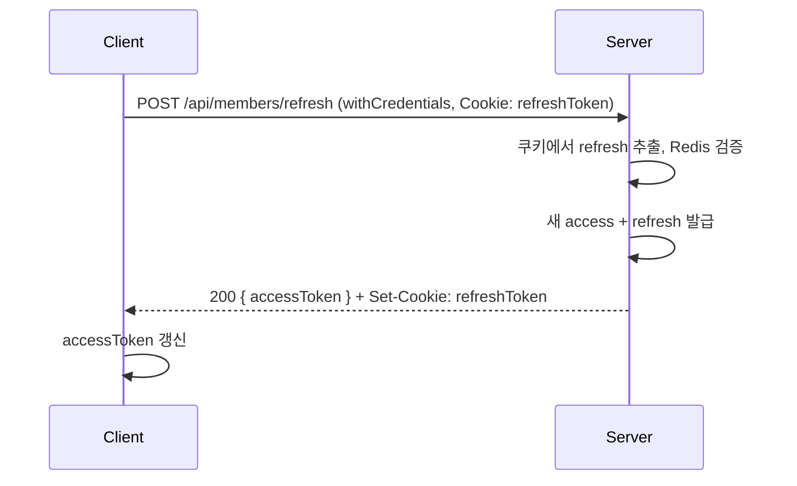
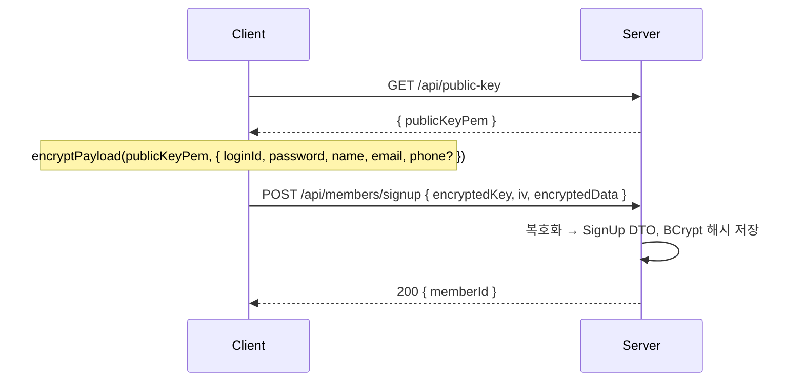

# 인증·보안 (HTTPS, Hybrid Encryption, OWASP)

## 1. 전체 흐름 (Mermaid)

### 1.1 로그인 (RSA + AES-GCM, Refresh Cookie)



### 1.2 토큰 갱신 (Cookie 기반)



- **React**: 브라우저가 쿠키 자동 전송/저장 (`withCredentials: true`).
- **Flutter**: 로그인/갱신 시 `Set-Cookie`에서 `cinema_refresh` 값을 파싱해 `flutter_secure_storage`에 저장; refresh 요청 시 `Cookie: cinema_refresh=<저장값>` 헤더로 전송.

### 1.3 회원가입 (EncryptedPayload)



---

## 2. 요구사항 대응

| 요구사항 | 적용 |
|---------|------|
| **HTTPS 전제** | 인증 통신은 HTTPS 가정. `auth.refresh-token.secure-cookie` true 시 쿠키 Secure. |
| **Hybrid (RSA + AES-GCM)** | `/api/public-key` → PEM 공개키. 클라이언트는 AES-256 키·IV 생성 → AES-GCM으로 payload 암호화 → AES 키를 RSA-OAEP로 암호화 후 전송. |
| **무결성** | AES-GCM 128비트 인증 태그. |
| **Rate limiting** | `AuthRateLimitFilter`: /login, /signup, /refresh per-IP 분당 제한 (`auth.rate-limit.*`). |
| **브루트포스 방어** | `LoginBruteForceService`: loginId당 실패 N회 초과 시 일정 시간 잠금 (`auth.brute-force.*`). |
| **BCrypt** | `PasswordEncoder` BCrypt. |
| **JWT 15분** | `jwt.access-token-expire-time` 900000. |
| **Refresh HttpOnly Cookie** | 로그인/갱신 시 `Set-Cookie` (HttpOnly, Secure, SameSite=Strict). |
| **에러 최소화** | 복호화 실패·계정 잠금 시 동일하게 "아이디 또는 비밀번호가 일치하지 않습니다." 등 일반 메시지. |

---

## 3. 구현 모듈

### Backend (Spring Boot)

- `RsaKeyManager`: RSA 2048 키 쌍 생성·보관, `getPublicKeyPem()`.
- `HybridDecryptionService`: `decrypt(encryptedKey, iv, encryptedData)` → UTF-8 평문 (RSA-OAEP SHA-1 + AES-GCM).
- `PublicKeyController`: `GET /api/public-key` → `{ publicKeyPem }`.
- `MemberController`: login/signup `EncryptedPayload` 수신 → 복호화 → 기존 서비스 호출. refresh는 쿠키에서 읽기. logout 시 쿠키 삭제.
- `RefreshTokenCookieHelper`: refresh 쿠키 설정/삭제/조회 (`auth.refresh-token.*`).
- `AuthRateLimitFilter`: login/signup/refresh per-IP rate limit.
- `LoginBruteForceService`: 실패 횟수·잠금 체크, `MemberService` 연동.
- `SecurityConfig`: `/api/public-key` permitAll, `AuthRateLimitFilter` 등록.

### Frontend (React)

- `utils/hybridEncryption`: `encryptPayload(publicKeyPem, plain)` → `EncryptedPayload` (Web Crypto RSA-OAEP + AES-GCM).
- `api/auth`: `getPublicKey` → login/signup 시 encrypt → POST. refresh/logout `withCredentials`.
- `api/axiosInstance`: `withCredentials: true`, 401 → refresh (Cookie) → 재시도, 실패 시 로그아웃·리다이렉트.
- `stores/authStore`: accessToken만 저장 (Refresh는 쿠키).

### Flutter (모바일)

- `utils/hybrid_encryption`: `parsePublicKeyFromPem` (asn1lib SPKI 파싱), `rsaOaepSha1Encrypt` (pointycastle OAEPEncoding.withSHA1), `encryptPayload` (encrypt AES-GCM + RSA-OAEP) → Java 서버와 호환.
- `services/auth_api_service`: `getPublicKey`, `login`, `signup`, `refresh`, `logout`. 로그인/갱신 시 Set-Cookie에서 `cinema_refresh` 파싱 후 `flutter_secure_storage` 저장; refresh 요청 시 `Cookie: cinema_refresh=<token>` 전송. accessToken도 secure storage 저장.
- `config/api_config`: API base URL, 경로, 쿠키 이름 상수 (`API_BASE_URL` fromEnvironment 지원).
- 동일 흐름: GET public-key → encryptPayload → POST login/signup; refresh는 저장된 refresh token을 Cookie 헤더로 전송.

---

## 4. 의존성

### build.gradle (Backend)

- 기존 JWT, Spring Security 등 유지.
- RSA/AES-GCM은 `java.security` / `javax.crypto` 기본 사용 (추가 의존성 없음).

### package.json (Frontend)

- 기존 axios, zustand 등 유지.
- Hybrid 암호화는 **Web Crypto API** 사용 (추가 패키지 없음).

### pubspec.yaml (Flutter)

```yaml
dependencies:
  encrypt: ^5.0.3
  pointycastle: ^3.9.1
  asn1lib: ^1.7.0
  flutter_secure_storage: ^9.2.2
  http: ^1.2.2
```

---

## 5. 설정 (application.yml)

```yaml
auth:
  refresh-token:
    cookie-name: cinema_refresh
    secure-cookie: false   # dev; prod에서 true (HTTPS)
    max-age-seconds: 604800
  rate-limit:
    login-per-minute: 10
    signup-per-minute: 5
    refresh-per-minute: 20
  brute-force:
    max-failed-attempts: 5
    lock-minutes: 15
```

---

## 6. OWASP 체크리스트

- **Authentication Cheat Sheet**: 비밀번호 BCrypt, 짧은 access token, refresh 쿠키( HttpOnly, Secure, SameSite), 브루트포스·rate limit 적용.
- **API Security Top 10**: 민감 데이터 암호화( hybrid ), 에러 메시지 최소화, rate limit으로 DoS 완화.
- **Mobile Top 10**: 동일 암호화·토큰 보관 원칙; Flutter에서는 `flutter_secure_storage` 사용 권장.

---

## 7. 보안 취약점·개선 사항

| 항목 | 위험 | 조치 |
|------|------|------|
| **HTTP 환경** | 쿠키·토큰 탈취, MITM | 운영에서는 반드시 HTTPS. `secure-cookie` true. |
| **CORS \*** | CSRF·크로스 오리진 오용 | 운영에서 `cors.allowed-origins` 특정 도메인만 허용. |
| **Rate limit 저장소** | 재시작 시 초기화 | 운영에서는 Redis 등 분산 저장 고려. |
| **CAPTCHA** | 자동화·봇 가입/로그인 | 회원가입 시 reCAPTCHA v3 등 연동 권장. |

---

## 8. 로그인 실패·복호화 실패 시 메시지

- 로그인 실패(계정 없음, 비밀번호 오류, 잠금): **"아이디 또는 비밀번호가 일치하지 않습니다."**
- 복호화 실패: **"잘못된 요청입니다."** (INVALID_INPUT)
- 상세 원인(잠금 여부, 복호화 오류 등)은 로그에만 기록하고 클라이언트에는 노출하지 않음.
