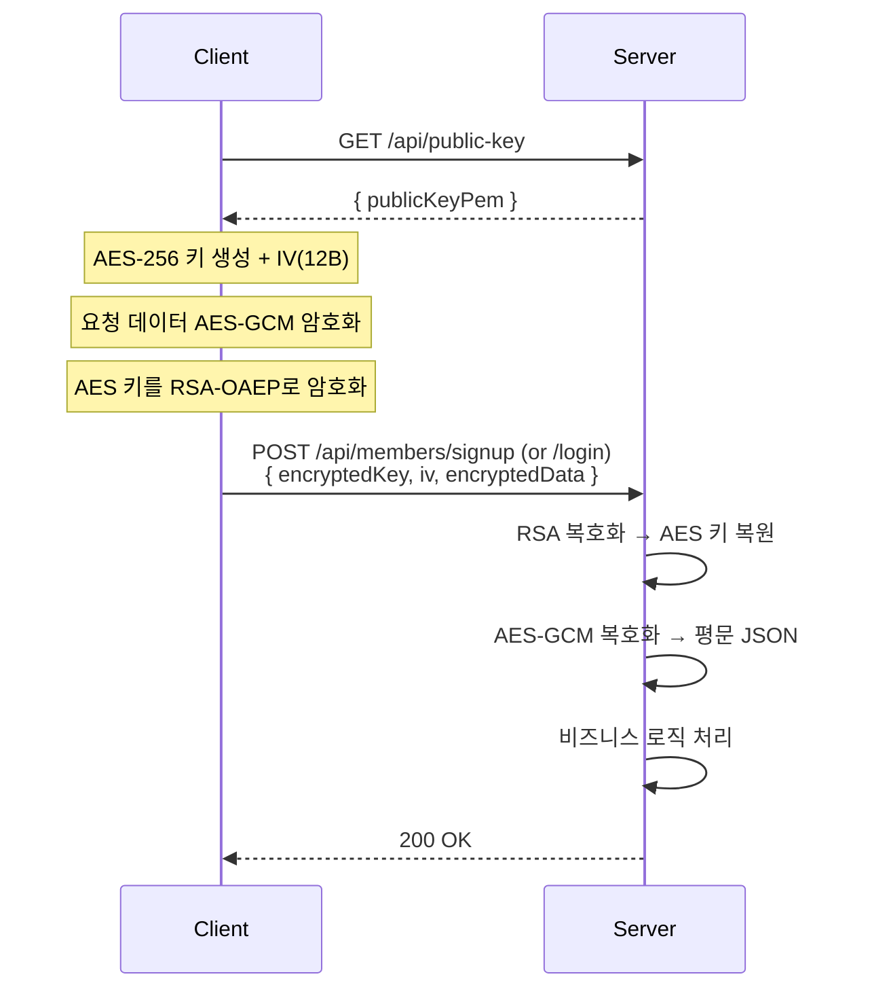

# 사용자 프로필 기능 (User Profile Feature)

본 문서는 영화관 예매 시스템의 **회원 프로필** 기능에 대한 설계 및 사용 가이드입니다.

**대상 독자:** 백엔드 개발자, 프론트엔드 개발자, 모바일 개발자

---

## 목차

1. [개요](#1-개요)
2. [데이터 모델](#2-데이터-모델)
3. [API 명세](#3-api-명세)
4. [인증 흐름](#4-인증-흐름)
5. [프론트엔드 (React)](#5-프론트엔드-react)
6. [모바일 (Flutter)](#6-모바일-flutter)
7. [비즈니스 규칙](#7-비즈니스-규칙)

---

## 1. 개요

회원 프로필 기능은 사용자 등록, 인증, 프로필 관리를 담당합니다.

### 주요 기능

| 기능 | 설명 |
|------|------|
| **회원가입** | RSA + AES-GCM 하이브리드 암호화로 안전한 가입 |
| **로그인** | JWT Access Token + Refresh Token (HttpOnly Cookie) |
| **프로필 조회** | 본인 정보 조회 (비밀번호 제외) |
| **프로필 수정** | 이름, 이메일, 연락처, 비밀번호 변경 |
| **HOLD 조회** | 본인이 임시 점유한 좌석 목록 (상영별 그룹핑) |
| **로그아웃** | Refresh Token 삭제 + 쿠키 제거 |

---

## 2. 데이터 모델

### 2.1 Member Entity

**위치:** `com.cinema.domain.member.entity.Member`

```
member
├── member_id       BIGINT (PK, AUTO_INCREMENT)
├── login_id        VARCHAR(50)  (UNIQUE, NOT NULL)
├── password_hash   VARCHAR(255) (NOT NULL, BCrypt)
├── name            VARCHAR(50)  (NOT NULL)
├── phone           VARCHAR(20)
├── email           VARCHAR(100) (UNIQUE)
├── role            ENUM('USER', 'ADMIN') (NOT NULL, DEFAULT 'USER')
├── status          ENUM('ACTIVE', 'INACTIVE') (NOT NULL, DEFAULT 'ACTIVE')
├── created_at      DATETIME (NOT NULL, 자동 생성)
└── updated_at      DATETIME (NOT NULL, 자동 갱신)
```

**인덱스:** `idx_member_status` (`status` 컬럼)

### 2.2 역할 (MemberRole)

| 역할 | 설명 |
|------|------|
| `USER` | 일반 사용자 (기본값) |
| `ADMIN` | 관리자 |

### 2.3 상태 (MemberStatus)

| 상태 | 설명 |
|------|------|
| `ACTIVE` | 활성 (기본값) |
| `INACTIVE` | 비활성 (로그인 불가) |

### 2.4 DTO 구조

| DTO | 용도 | 주요 필드 |
|-----|------|----------|
| `MemberRequest.SignUp` | 회원가입 요청 | loginId, password, name, phone?, email |
| `MemberRequest.Login` | 로그인 요청 | loginId, password |
| `MemberRequest.UpdateProfile` | 프로필 수정 요청 | password?, name?, email?, phone? |
| `MemberProfileResponse` | 프로필 조회 응답 | loginId, name, email, phone |
| `MemberHoldSummaryResponse` | HOLD 목록 응답 | screeningId, movieTitle, screenName, startTime, seats[] |
| `TokenResponse` | 토큰 응답 (내부용) | accessToken, refreshToken |
| `AccessTokenResponse` | Access Token 응답 | accessToken |

---

## 3. API 명세

**Base URL:** `/api/members`

### 3.1 회원가입

```
POST /api/members/signup
```

- **인증:** 불필요
- **요청:** `EncryptedPayload` (RSA + AES-GCM 하이브리드 암호화)
- **복호화 후 본문:**

```json
{
  "loginId": "user01",
  "password": "securePassword123",
  "name": "홍길동",
  "phone": "010-1234-5678",
  "email": "user01@example.com"
}
```

- **응답:** `200 OK` — 생성된 회원 ID (Long)

### 3.2 로그인

```
POST /api/members/login
```

- **인증:** 불필요
- **요청:** `EncryptedPayload`
- **복호화 후 본문:**

```json
{
  "loginId": "user01",
  "password": "securePassword123"
}
```

- **응답:** `200 OK`

```json
{
  "accessToken": "eyJhbGciOiJIUzI1NiIs..."
}
```

- **Set-Cookie:** `cinema_refresh=<refreshToken>; HttpOnly; Secure; SameSite=Strict`

### 3.3 프로필 조회

```
GET /api/members/me
```

- **인증:** 필수 (Bearer Token)
- **응답:** `200 OK`

```json
{
  "loginId": "user01",
  "name": "홍길동",
  "email": "user01@example.com",
  "phone": "010-1234-5678"
}
```

### 3.4 프로필 수정

```
PATCH /api/members/me
```

- **인증:** 필수 (Bearer Token)
- **요청:** 변경할 필드만 전송

```json
{
  "name": "김철수",
  "email": "new@example.com",
  "phone": "010-9999-8888",
  "password": "newPassword456"
}
```

- **응답:** `200 OK`
- **규칙:**
  - 전달된 필드만 수정 (null 필드는 기존 값 유지)
  - 비밀번호 변경 시 BCrypt 인코딩 후 저장
  - 이메일 중복 시 `DUPLICATE_EMAIL` 에러

### 3.5 HOLD(장바구니) 조회

```
GET /api/members/me/holds
```

- **인증:** 필수 (Bearer Token)
- **응답:** `200 OK`

```json
[
  {
    "screeningId": 1,
    "movieTitle": "인터스텔라",
    "screenName": "1관",
    "startTime": "2026-02-06T14:00:00",
    "seats": [
      {
        "seatId": 42,
        "rowLabel": "E",
        "seatNo": 7,
        "displayName": "E7",
        "holdToken": "abc123-def456",
        "holdExpireAt": "2026-02-06T13:55:00"
      }
    ]
  }
]
```

### 3.6 토큰 갱신

```
POST /api/members/refresh
```

- **인증:** 불필요 (Cookie 기반)
- **Cookie:** `cinema_refresh=<refreshToken>`
- **응답:** `200 OK` — 새 Access Token + Set-Cookie (새 Refresh Token)

### 3.7 로그아웃

```
POST /api/members/logout
```

- **인증:** 필수 (Bearer Token)
- **응답:** `200 OK`
- **동작:** Redis에서 Refresh Token 삭제 + 쿠키 제거

---

## 4. 인증 흐름

### 4.1 회원가입·로그인 암호화



### 4.2 인증 토큰

| 토큰 | 유효시간 | 저장소 |
|------|---------|--------|
| Access Token | ≤ 15분 (설정값) | 클라이언트 메모리/localStorage |
| Refresh Token | 설정값 | Redis (서버) + HttpOnly Cookie (클라이언트) |

### 4.3 보안 정책

- **Brute-force 방어:** 로그인 실패 횟수 추적, 임계치 초과 시 계정 잠금
- **비활성 계정:** `INACTIVE` 상태의 회원은 로그인·프로필 조회·수정 불가
- **비밀번호:** BCrypt 해시 저장, 평문 노출 없음
- **JWT 마스킹:** 로그에 토큰 전체 값이 기록되지 않음 (일부만 마스킹)

---

## 5. 프론트엔드 (React)

### 5.1 마이페이지 구조

**위치:** `frontend/src/pages/MyPage.tsx`  
**라우트:** `/mypage`

| 탭 | 기능 |
|----|------|
| **내 정보** | 프로필 조회 및 수정 (이메일, 연락처, 비밀번호) |
| **장바구니** | HOLD 좌석 목록 조회, 만료 시간 표시 |
| **결제/예매 내역** | 예매 및 결제 이력 조회 |

### 5.2 API 호출

```typescript
// 프로필 조회
membersApi.getProfile()      // GET /api/members/me

// 프로필 수정
membersApi.updateProfile({   // PATCH /api/members/me
  name, email, phone, password
})

// HOLD 조회
membersApi.getMyHolds()      // GET /api/members/me/holds
```

### 5.3 상태 관리

- **인증 상태:** Zustand 스토어 + localStorage (Access Token)
- **프로필 데이터:** 컴포넌트 로컬 상태 (API 호출 시 갱신)

---

## 6. 모바일 (Flutter)

### 6.1 마이페이지 구조

**위치:** `mobile/lib/screens/mypage/my_page_screen.dart`

| 탭 | 기능 |
|----|------|
| **내 정보** | 프로필 조회 및 수정 |
| **장바구니** | HOLD 좌석 목록 조회 |
| **결제/예매 내역** | 예매 및 결제 이력 조회 |

### 6.2 상태 관리

- **아키텍처:** Riverpod + MVVM 패턴
- **인증 토큰:** `flutter_secure_storage`에 Refresh Token 저장
- **프로필 데이터:** Riverpod async provider로 관리

---

## 7. 비즈니스 규칙

| 규칙 | 설명 |
|------|------|
| 로그인 ID 중복 불가 | 회원가입 시 `DUPLICATE_LOGIN_ID` 에러 반환 |
| 이메일 중복 불가 | 프로필 수정 시 `DUPLICATE_EMAIL` 에러 반환 |
| 비활성 계정 접근 제한 | `INACTIVE` 회원은 로그인, 프로필 조회/수정, HOLD 조회 불가 |
| 만료 HOLD 제외 | HOLD 조회 시 `holdExpireAt`이 지난 좌석은 응답에 포함하지 않음 |
| 부분 수정 지원 | 프로필 수정 시 전달된 필드만 업데이트 (null 필드는 기존 값 유지) |
| 비밀번호 보안 | BCrypt 인코딩 후 저장, 응답에 비밀번호 필드 미포함 |

---

## 관련 문서

- [SECURITY_AUTH.md](./SECURITY_AUTH.md) — 인증·보안 상세 (RSA + AES-GCM, JWT, OWASP)
- [ARCHITECTURE_BACKEND.md](./ARCHITECTURE_BACKEND.md) — 백엔드 아키텍처 (ERD, 패키지 구조)
- [ARCHITECTURE_FRONTEND.md](./ARCHITECTURE_FRONTEND.md) — 프론트엔드 아키텍처 (React, 라우팅)
- [ARCHITECTURE_MOBILE.md](./ARCHITECTURE_MOBILE.md) — 모바일 아키텍처 (Flutter, Riverpod)
- [BACKEND_MODULES.md](./BACKEND_MODULES.md) — 백엔드 재사용 모듈 (DTO 패턴, 예외 처리)
